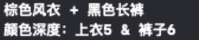
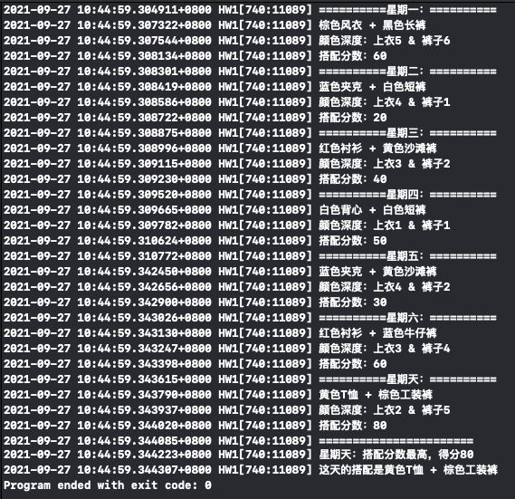

# 实验报告
## 开发环境
+ Mac OS
+ Objective-C
+ Xcode
## 实验任务
+ 安装配置Mac OS和Xcode
+ 熟悉Mac OS按键操作
+ 熟悉Xcode项目结构，编译运行第一个Xcode项目，项目创建流程详见tutorial
+ 张三衣柜里有N（N>3）件上衣：白色T恤.......M(M>4)条裤子：灰色沙滩裤........需要帮张三在未来的一周内挑选搭配。（需要自己定义N、M取值）
## 实验要求
+ 上衣未来两天内不可重复穿着，裤子未来一天内不可重复穿着。
+ 不同颜色搭配可获得不同分数。
+ 需要自行定义颜色搭配分数。
+ 需要用到多态。
+ 输出程序设计和运行过程中，相关设计体现的oo特性（数据隐秘性、封装性、继承、多态）。
## 设计思路
+ 定义N=5，M=6，即张三有5件上衣，6条裤子
+ 衣物有白色、黄色、红色、蓝色、棕色、黑色六种颜色，深度从1到6，上衣没有黑色的
+ 上衣颜色越浅，裤子颜色越深，搭配分数越高，即搭配分数=（裤子深度-上衣深度+5）*10
+ 设计三个类：`Clothing`、`UpperGarment`、`Trousers`，其中`Clothing`类是`UpperGarment`类和`Trousers`类的父类
+ 通过生成随机数获得随机搭配
+ 通过记录各衣物最近穿过的日期来避免重复穿着
## 具体实现
设计三个类：衣物类`Clothing`、上衣类`UpperGarment`、裤子类`Trousers`，其中`Clothing`类是`UpperGarment`类和`Trousers`类的父类。在main.m中完成5件上衣，6条裤子的实例化、随机搭配、计算分数、得出分数最高搭配。
### Clothing类
在`Clothing`类中定义衣物类的四个属性：
```
NSString* _type;//衣物名称
NSString* _color;//衣物颜色
NSInteger _depth;//颜色深度
NSInteger _date;//最近一次穿着是星期几，0表示没穿过
```
对init方法做如下实现，创建实例时会将_date属性值设置为0：
```
-(id)init{
    self->_date=0;
    return self;
}
```
对四个属性的set/get方法做如下实现：
```
-(void)setType:(NSString*)type{
    self->_type=type;
}

-(NSString*)type{
    return self->_type;
}

-(void)setColor:(NSString*)color{
    self->_color=color;
}

-(NSString*)color{
    return self->_color;
}

-(void)setDepth:(NSInteger)depth{
    self->_depth=depth;
}

-(NSInteger)depth{
    return self->_depth;
}

-(void)setDate:(NSInteger)date{
    self->_date=date;
}

-(NSInteger)date{
    return self->_date;
}
```
### UpperGarment类
上衣类，是Clothing类的子类，增加了check方法并做如下实现：
```
-(bool)check:(NSInteger)date{
    if(date-self->_date<3&&self->_date!=0)return false;
    else return true;
}
```
若这件上衣过去两天内有穿过就返回false，否则返回true。
### Trousers类
裤子类，是Clothing类的子类，增加了check方法并做如下实现：
```
-(bool)check:(NSInteger)date{
    if(date-self->_date==1&&self->_date!=0)return false;
    else return true;
}
```
若这件裤子过去一天内有穿过就返回false，否则返回true。
### main.m
+ 辅助函数
    + 计算搭配得分的函数getScore，搭配分数=（裤子深度-上衣深度+5）*10
        ```
        NSInteger getScore(UpperGarment* u,Trousers* t){
            return ([t depth]-[u depth]+5)*10;
        }
        ```
    + 将数字转换为星期几字符串的函数getDate
        ```
        NSString* getDate(NSInteger date){
            switch (date){
                case 1:
                    return @"星期一：";
                case 2:
                    return @"星期二：";
                case 3:
                    return @"星期三：";
                case 4:
                    return @"星期四：";
                case 5:
                    return @"星期五：";
                case 6:
                    return @"星期六：";
            }
            return @"星期天：";
        }
        ```
+ main函数
    + 创建5件上衣、6条裤子的实例并设置属性值，然后分别添加到上衣动态数组和裤子动态数组中
        ```
        UpperGarment* ug1=[[UpperGarment alloc] init];
        ug1.type=@"风衣";
        ug1.color=@"棕色";
        ug1.depth=5;
        UpperGarment* ug2=[[UpperGarment alloc] init];
        ug2.type=@"夹克";
        ug2.color=@"蓝色";
        ug2.depth=4;
        UpperGarment* ug3=[[UpperGarment alloc] init];
        ug3.type=@"衬衫";
        ug3.color=@"红色";
        ug3.depth=3;
        UpperGarment* ug4=[[UpperGarment alloc] init];
        ug4.type=@"T恤";
        ug4.color=@"黄色";
        ug4.depth=2;
        UpperGarment* ug5=[[UpperGarment alloc] init];
        ug5.type=@"背心";
        ug5.color=@"白色";
        ug5.depth=1;
        NSMutableArray* ug=[NSMutableArray arrayWithCapacity:0];
        [ug addObjectsFromArray:@[ug1,ug2,ug3,ug4,ug5]];
        Trousers* t1=[[Trousers alloc] init];
        t1.type=@"短裤";
        t1.color=@"白色";
        t1.depth=1;
        Trousers* t2=[[Trousers alloc] init];
        t2.type=@"沙滩裤";
        t2.color=@"黄色";
        t2.depth=2;
        Trousers* t3=[[Trousers alloc] init];
        t3.type=@"运动裤";
        t3.color=@"红色";
        t3.depth=3;
        Trousers* t4=[[Trousers alloc] init];
        t4.type=@"牛仔裤";
        t4.color=@"蓝色";
        t4.depth=4;
        Trousers* t5=[[Trousers alloc] init];
        t5.type=@"工装裤";
        t5.color=@"棕色";
        t5.depth=5;
        Trousers* t6=[[Trousers alloc] init];
        t6.type=@"长裤";
        t6.color=@"黑色";
        t6.depth=6;
        NSMutableArray* t=[NSMutableArray arrayWithCapacity:0];
        [t addObjectsFromArray:@[t1,t2,t3,t4,t5,t6]];
        ```
    + 使用随机数函数arc4random_uniform选取衣物，如果重复穿着就选下一件，直到选到符合要求的衣物，调用getScore函数计算得分，输出当天搭配和分数，然后把当天得分与之前的最高分比较，更新最高分数及对应搭配的数组下标
        ```
        NSInteger MaxScore=0, MaxDate=0,MaxUG=-1,MaxT=-1;
        
        for (int i=1; i<=7; i++) {
            NSInteger id_ug=arc4random_uniform(5);
            NSInteger id_t=arc4random_uniform(6);
            while (![ug[id_ug] check:i]) {
                id_ug=(id_ug+1)%5;
            }
            [ug[id_ug] setDate:i];
            while (![t[id_t] check:i]) {
                id_t=(id_t+1)%6;
            }
            [t[id_t] setDate:i];
            NSInteger score=getScore(ug[id_ug], t[id_t]);
            NSLog(@"==========%@==========",getDate(i));
            NSLog(@"%@%@ + %@%@",[ug[id_ug] color],[(Clothing*)[ug objectAtIndex:id_ug] type],[t[id_t] color],[(Clothing*)[t objectAtIndex:id_t] type]);
            NSLog(@"颜色深度：上衣%ld & 裤子%ld",[ug[id_ug] depth],[t[id_t] depth]);
            NSLog(@"搭配分数：%ld",score);
            if(score>MaxScore){
                MaxScore=score;
                MaxDate=i;
                MaxUG=id_ug;
                MaxT=id_t;
            }
        }
        ```
    + 输出哪一天搭配分数最高及搭配是什么
        ```
        NSLog(@"=======================");
        NSLog(@"%@搭配分数最高，得分%ld",getDate(MaxDate),MaxScore);
        NSLog(@"这天的搭配是%@%@ + %@%@",[ug[MaxUG] color],[(Clothing*)[ug objectAtIndex:MaxUG] type],[t[MaxT] color],[(Clothing*)[t objectAtIndex:MaxT] type]);
        ```
## 要点分析
+ 输出一周内每天张三的随机搭配，包括衣物的关键属性、搭配分数:
    + 关键属性包括衣物颜色、名称、种类、颜色深度，如下图：

        
    + 详见运行结果
+ 输出哪一天搭配分数最高及搭配是什么：
    + 详见运行结果
+ 类的设计与封装：
    + 一共`Clothing`、`UpperGarment`、`Trousers`三个类，详细分析见上述具体实现
+ 类与类之间的继承关系与多态的体现
    + 继承关系：`Clothing`类是`UpperGarment`类和`Trousers`类的父类，这两个子类继承了父类的四个属性和对应属性的set/get函数以及实现了的初始化函数。
    + 多态：两个子类`UpperGarment`类和`Trousers`类各自实现了check函数以检查对应衣物是否近期重复穿着，实现方式不同以满足上衣未来两天内不可重复穿着，裤子未来一天内不可重复穿着的实验要求。在main.m中调用set或get函数可以将实例强制转化为Clothing* 类型后调用，调用check函数必须是UpperGarment* 或 Trousers* 类型。
## 运行结果
